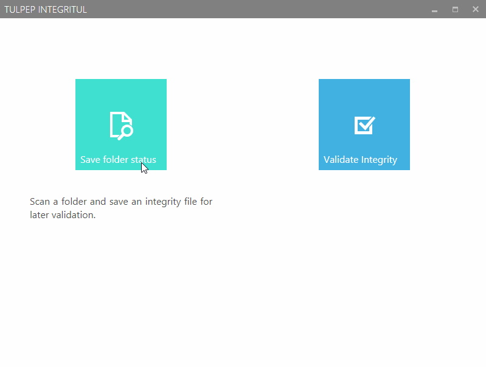

# Integritul 
Tool that allows you to check the integrity of an drive or folder and identify the changes made to its content. 

First, you can choose any folder to generate a small .integritul file that contains the HASH of every file inside the folder you choose, it recursively obtains the status of all items in every folder inside the selected one. This file is very small, even for very large folders. 

Then, you compare your folder or drive with the generated .integritul file and Integritul will show you the differences between the saved and current folder status. It will show which files have been deleted, added or modified and their respective path. 

##[Download latest version](https://github.com/Tulpep/Integritul/releases/latest)
